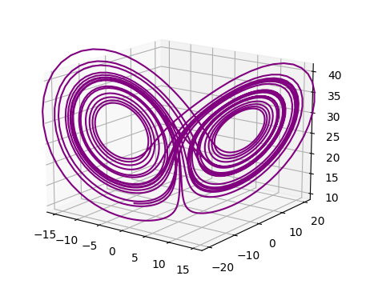

# RK45

Simple RK45 integrator implementation in Python

## usage

Lets use rk45 to simulate the Lorenz Attractor.

The Lorenz Attractor is defined as 

$$\dot{x} = \sigma(y - x)$$

$$\dot{y} = x(\rho - z) - y$$

$$\dot{z} = xy - \beta z$$

where $$\sigma, \rho, \beta \in \mathbb{R}$$

to define the system in Python we will return a 3 dimensional vector 
$$\langle 
    \dot{x}, 
    \dot{y}, 
    \dot{z} 
\rangle$$

```python
def lorenz(t,y):
    ''' The chaotic Lorenz 1963 attractor
    '''
    sigma = 10
    beta = 8/3
    rho = 28

    y_prime = [sigma*(y[1] - y[0]), y[0]*(rho - y[2]) - y[1], (y[0] * y[1]) - (beta * y[2])]
    return np.array(y_prime)
```

now to get the trajectory

```python
from rk45 import rk45

# Initial Conditions
y0 = np.array([-8, 8, 27])
# Initial Time
t0 = 0
# Boundary Time (no further integration is done past this time)
t_bound = 25
# Integrate the system's trajectory in time
trajectory = rk45(lorenz, t0, y0, t_bound)
# This returns a matrix where the ith column vector is the state of the system at time i
```

### Visualizing the results

```python
import matplotlib.pyplot as plt

fig = plt.figure()
ax = fig.add_subplot(projection='3d')
ax.plot(trajectory[0,:], trajectory[1,:], trajectory[2,:], 'purple')
plt.show()
```

<p align='center'>
    
</p>