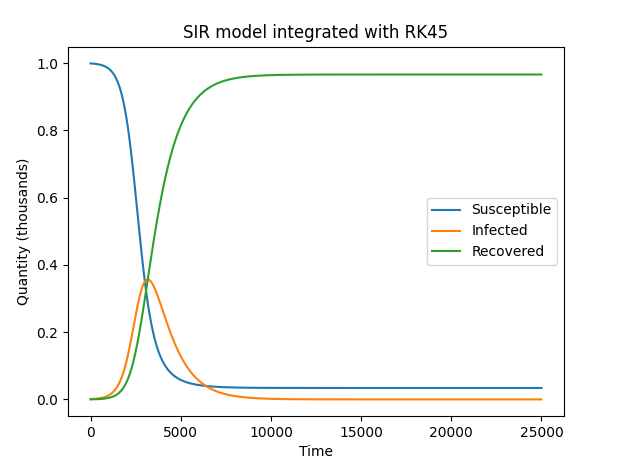

# RK45

Simple RK45 integrator implementation in Python

## usage

Lets use rk45 to simulate the Lorenz Attractor.

The Lorenz Attractor is defined as 

$$\dot{x} = \sigma(y - x)$$

$$\dot{y} = x(\rho - z) - y$$

$$\dot{z} = xy - \beta z$$

where $$\sigma, \rho, \beta \in \mathbb{R}$$

to define the system in Python we will return a 3 dimensional vector 
$$\langle 
    \dot{x}, 
    \dot{y}, 
    \dot{z} 
\rangle$$

```python
def lorenz(t,y):
    ''' The chaotic Lorenz 1963 attractor
    '''
    sigma = 10
    beta = 8/3
    rho = 28

    y_prime = [sigma*(y[1] - y[0]), y[0]*(rho - y[2]) - y[1], (y[0] * y[1]) - (beta * y[2])]
    return np.array(y_prime)
```

now to get the trajectory

```python
from rk45 import rk45

# Initial Conditions
y0 = np.array([-8, 8, 27])
# Initial Time
t0 = 0
# Boundary Time (no further integration is done past this time)
t_bound = 25
# Integrate the system's trajectory in time
trajectory = rk45(lorenz, t0, y0, t_bound)
# This returns a matrix where the ith column vector is the state of the system at time i
```

### Visualizing the results

```python
import matplotlib.pyplot as plt

fig = plt.figure()
ax = fig.add_subplot(projection='3d')
ax.plot(trajectory[0,:], trajectory[1,:], trajectory[2,:], 'purple')
plt.show()
```

<p align='center'>
    
</p>

## More examples

### SIR Model

The SIR model is the first mathematical model of infectious disease. It assumes a homogenous, constant population that can be described 3 'compartments': Susceptibles, Infected, and Recovered. The infectivity of the disease and the recovery rate are constants $\beta$ and $\gamma$ respectively.

Let $S$, $I$, $R$ denote the quantity of people in each compartment

$N := S + I + R$

The model is the following system of ODEs


$$\frac{dS}{dt} = -\frac{\beta S I}{N}$$
$$\frac{dI}{dt} = \frac{\beta S I}{N} - \gamma I$$
$$\frac{dR}{dt} = \gamma I$$

Given some IVP, $\langle S0, I0, R0 \rangle$ and constants $\beta$, $\gamma$

```python
def deriv(t,y):
    ''' Derivatives for the SIR model with constant values of beta and gamma
    '''
    beta = 0.35
    gamma = 1./10
    N = 1000

    dSdt = -beta*y[0]*y[1] / N
    dIdt = (beta*y[0]*y[1] / N) - gamma*y[1]
    dRdt = gamma*y[1]

    return np.array([dSdt, dIdt, dRdt])

# Total population
N = 1000
# initial infected
I0 = 1
# initial recovered
R0 = 0
# initial susceptible
S0 = N - I0 - R0
# initial conditions vector
y0 = np.array([S0, I0, R0])

t0 = 0
t_bound = 250

S, I, R = rk45(deriv, t0, y0, t_bound)
```

for this particular system the trajectory looks like this

<p align='center'>
    
</p>

There are many other [Compartmental Models](https://en.wikipedia.org/wiki/Compartmental_models_in_epidemiology) that can be simulated in a similar manner with rk45. Each one uses different assumptions about the nature of the outbreak. In reality, SIR models are often not accurate on their own largely due to their simplicity. A more accurate compartmental model may have an intermediate stage between Susceptible and Infected called Exposed. Immunity loss, maternally derived immunity, vaccinations, control measures (infectivity rates, recovery rates, etc change over time), etc etc.